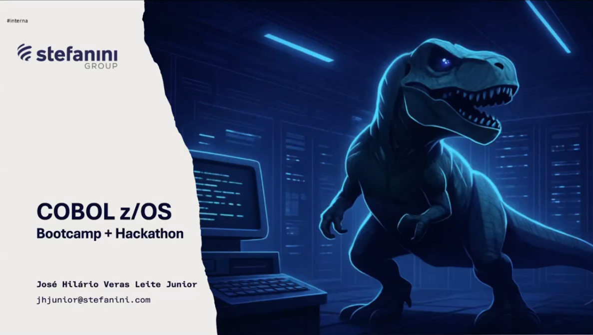

# 🦖 COBOL z/OS — Bootcamp & Hackathon Stefanini

Repositório dedicado ao armazenamento dos desafios, exercícios e aprendizados práticos desenvolvidos durante o **Bootcamp e Hackathon de COBOL z/OS** promovido pelo Stefanini Group. O objetivo desta jornada é a ambientação na arquitetura de Mainframe e o desenvolvimento de soluções procedurais robustas com foco em backend bancário e corporativo.



---

## 🏛️ Por que estudar COBOL em pleno século XXI?

Apesar de ser rotulado frequentemente como uma tecnologia do passado, o **COBOL (Common Business-Oriented Language)** é um dos pilares mais resilientes e críticos da infraestrutura financeira e corporativa global.

- **Volume de Transações:** Estima-se que mais de 70% das transações bancárias mundiais e sistemas de cartões de crédito ainda passem por linhas de código escritas em COBOL operando emMainframes IBM z/OS.
- **Alta Performance e Confiabilidade:** Diferente de ecossistemas com strings dinâmicas, a rigidez da alocação de memória estática e a precisão aritmética do COBOL fazem dele a escolha perfeita para o processamento em lote (Batch) de bilhões de registros com risco zero de arredondamento incorreto.
- **Mercado Altamente Aquecido:** Com a necessidade de modernização e a aposentadoria dos profissionais seniores, há uma demanda massiva e estratégica por novos Engenheiros de Software que compreendam a lógica procedural clássica, criando uma ponte fundamental entre os sistemas legados e as APIs modernas.

Dominar essa stack não é apenas olhar para o passado, mas compreender os alicerces de alta disponibilidade e volume de dados que sustentam as maiores corporações do mundo.

---

## 🛠️ Ambiente de Desenvolvimento Local

O desenvolvimento e a compilação dos exercícios deste repositório foram realizados localmente em ambiente Linux (**Ubuntu 22.04 LTS**), utilizando:

- **Compilador:** GnuCOBOL (`cobc`)
- **IDE:** Visual Studio Code (VS Code) com a extensão oficial _IBM Z Open Editor_ e suporte ao ambiente Java OpenJDK 21.

## 🚀 Como Executar Localmente

Para compilar e gerar o binário executável de qualquer um dos programas no Linux, utilize o terminal na pasta do arquivo:

```bash
# Compilar o arquivo (substitua pelo nome do programa desejado)
cobc -x -o BHCP0008 BHCP0008.cbl

# Executar o programa gerado
./BHCP0008
```
